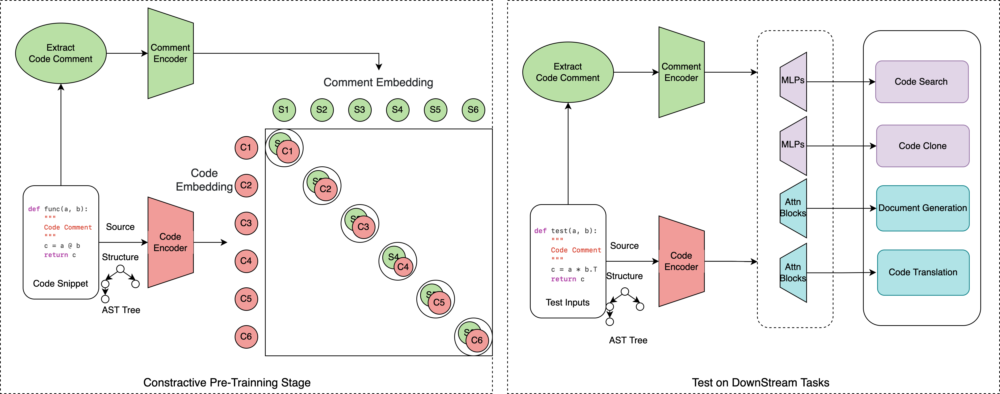

# C3P
Code implementation of C3P model


## Code-Comment Pre-Trainings


### 1. Brief Introduction
This repository contains official implementation of the paper C3P (Code-Comment Pre-Training).

#### Architecture

<p align="center">
        </a>
</p>

```
from models.model import C3PModel, Config
config = Config
c3p = C3PModel(config=Config())
```

> How to run?
* 1. Deploy our files on the Linux. Download the datasets and move to the 

* 2. Replace the path to your own path of files.

* 3. Upzip the dataset file to the ./content.

* 4. Run each cells of code,  and modify the hyperparameters in the Arguments Class.
Modify the hyperparameters if you run the bash file of script/run.sh

```
--train_data_file=dataset/<data_name>
--output_dir=results/logs/<logs_name>.log  
--do_train 
--do_test
--cpkt_path=results/cpkt/<cpkt_name>
--train_batch_size=1024
--eval_batch_size=1024
--learning_rate=2e-5
--max_grad_norm=1.
--num_train_epochs=500
--seed=42
--max_length=320
--log_interval=10
```
The setup of each hyperparameters will get different outputs in our experiments via runining file:
```bash
cd script
bash run.sh GPU_IDS
```
